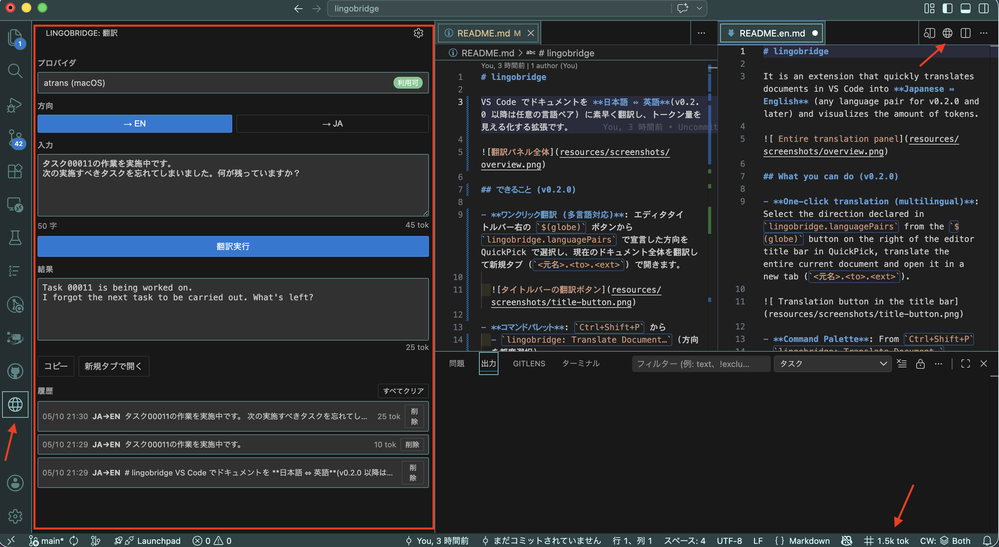
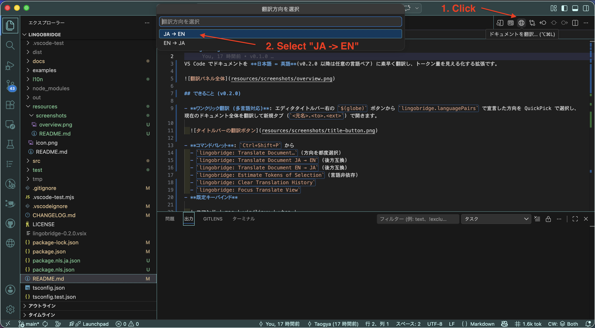

# lingobridge

VS Code でドキュメントを **日本語 ⇔ 英語**(v0.2.0 以降は任意の言語ペア) に素早く翻訳し、トークン量を見える化する拡張です。



## できること (v0.2.0)

- **ワンクリック翻訳 (多言語対応)**: エディタタイトルバー右の `$(globe)` ボタンから `lingobridge.languagePairs` で宣言した方向を QuickPick で選択し、現在のドキュメント全体を翻訳して新規タブ (`<元名>.<to>.<ext>`) で開きます。

  

- **コマンドパレット**: `Ctrl+Shift+P` から
  - `lingobridge: Translate Document…` (方向を都度選択)
  - `lingobridge: Translate Document JA → EN` (後方互換)
  - `lingobridge: Translate Document EN → JA` (後方互換)
  - `lingobridge: Estimate Tokens of Selection` (言語非依存)
  - `lingobridge: Clear Translation History`
  - `lingobridge: Focus Translate View`
- **既定キーバインド**

  | コマンド | mac | win/linux | when |
  | --- | --- | --- | --- |
  | `lingobridge.translateDocument` | `cmd+alt+l` | `ctrl+alt+l` | `editorTextFocus` |
  | `lingobridge.translateDocumentToEnglish` | `cmd+alt+e` | `ctrl+alt+e` | `editorTextFocus` |
  | `lingobridge.translateDocumentToJapanese` | `cmd+alt+j` | `ctrl+alt+j` | `editorTextFocus` |
  | `lingobridge.estimateSelectionTokens` | `cmd+alt+t` | `ctrl+alt+t` | `editorHasSelection` |
  | `lingobridge.focusTranslateView` | `cmd+alt+shift+l` | `ctrl+alt+shift+l` | — |

  既定が他拡張と衝突する場合は VS Code の Keybindings UI (`Cmd/Ctrl+K Cmd/Ctrl+S`) で差替えてください。
- **右クリック (エディタ内)**: 翻訳系コマンド + トークン推定にアクセス可能。
- **Activity Bar**: `$(globe)` アイコン (lingobridge) から翻訳パネルを起動。
  - 方向ボタン群は `lingobridge.languagePairs` の内容から自動生成。
  - 入力欄でリアルタイムにトークン更新、翻訳実行で結果と結果トークンを表示、コピー / 新規タブで開く。
  - **翻訳履歴**: 直近 N 件 (既定 50) を一覧表示、行クリックで復元、個別 / 一括クリア。

- **Status Bar**: `$(symbol-numeric) 1.2k tok` 形式 (選択時は選択分、未選択時はドキュメント全体)。言語ラベルなし。
- **保護機能 (任意)**: コードブロック・インラインコード・URL を翻訳前に退避し、翻訳後に復元。
- **多言語 UI (i18n)**: 既定は英語、`vscode.env.language` が `ja*` のとき日本語に自動切替。

## 設定 (settings.json)

| キー | 既定 | 説明 |
| --- | --- | --- |
| `lingobridge.provider.active` | `atrans` | 使用プロバイダ (`atrans` \| `libretranslate`) |
| `lingobridge.languagePairs` | `[ja→en, en→ja]` | タイトルバー / 右クリック / 翻訳パネルに並べる方向 (任意のペア) |
| `lingobridge.protection.enabled` | `true` | 保護機能 ON/OFF |
| `lingobridge.output.openInNewTab` | `true` | 翻訳結果を新規タブで開く |
| `lingobridge.statusBar.enabled` | `true` | Status Bar 表示 |
| `lingobridge.input.translateOnEnter` | `true` | 入力欄 Enter で翻訳実行 |
| `lingobridge.tokenEstimator.engine` | `heuristic` | `tiktoken` で `js-tiktoken` (cl100k_base) に切替 |
| `lingobridge.history.enabled` | `true` | 翻訳履歴を `globalState` に保存 (Sync には載せない) |
| `lingobridge.history.maxEntries` | `50` | 履歴上限 (0〜500、0 で実質無効) |

`lingobridge.languagePairs` の例:

```jsonc
"lingobridge.languagePairs": [
  { "from": "ja", "to": "en", "label": "→ EN" },
  { "from": "en", "to": "ja", "label": "→ JA" },
  { "from": "ja", "to": "zh", "label": "→ ZH" }
]
```

プロバイダ個別の設定と導入手順は [docs/setup/providers/](docs/setup/providers/README.md) を参照してください。
そのまま貼り付けられる `settings.json` サンプルは [examples/settings/](examples/settings/README.md) にあります。

## プロバイダ

使用するプロバイダを 1 つ以上セットアップしてください。導入手順は各ドキュメントを参照:

- [atrans (macOS)](docs/setup/providers/atrans.md) — 既定。Apple Translation framework。
- [LibreTranslate (マルチOS)](docs/setup/providers/libretranslate.md) — ローカル Python サーバ。

## 開発

```bash
cd lingobridge
npm install
npm run compile
# F5 で Extension Development Host を起動
npm test
```

## インストール

### ユーザー向け

VS Code Marketplace から `lingobridge` を検索してインストールしてください。

### 開発者向け (VSIX 手動インストール)

```bash
cd lingobridge
npm install
npm run package:vsix     # lingobridge-0.2.0.vsix を生成
code --install-extension lingobridge-0.2.0.vsix
# アンインストールは code --uninstall-extension taogya.lingobridge
```

## ライセンス

BSD-3-Clause (Copyright © 2026 Taogya). 詳細は [LICENSE](LICENSE)。
